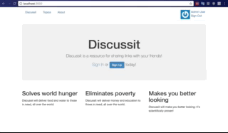

# Discussit
---
A topic-based social media app that creates forums to discuss ideas.

## Description

##### Users
There are three user levels: admin, member, and non-member.

* Admins can add and delete all comments, posts, and topics.
* Members cannot create topics, but can add posts and comments. They can only delete their own posts and comments.
* Non-members do not need to sign in, but can only view topics, posts and comments.

##### Posts

Posts are organized by topics. Users can add posts to a topic and comment on the posts of others. Votes raise or lower the profile of posts in the post list.

## Getting Started

Discussit can be downloaded and installed or edited easily.

### Prerequisites

This project uses `Rails 4.2.8`.

### Installing

In order to install **Discussit** locally:

1. Clone or download this repo.
2. Run `bundle install` to install dependencies
3. Run `rake db:create`, `rake  db:migrate`, and `rake db:seed` to setup the database
4. Run `rails s` and navigate to `localhost:3000` to use in your browser.

### Testing

Tests for the controllers and models are easy to run to ensure all is working.

Simply run `rspec spec/controllers` to run all the tests for controllers. Individual tests can be run with `rspec spec/folder_name/file_name.rb`.

## Authors

* **Scott Lenander** - [SJl149](https://github.com/SJl149)

## Acknowledgements

Special thanks to my mentor, Charlie Gaines [beaugaines](https://github.com/beaugaines), and [Bloc](http://bloc.io).
